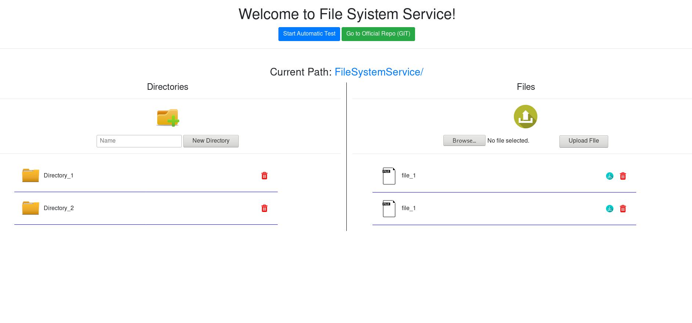
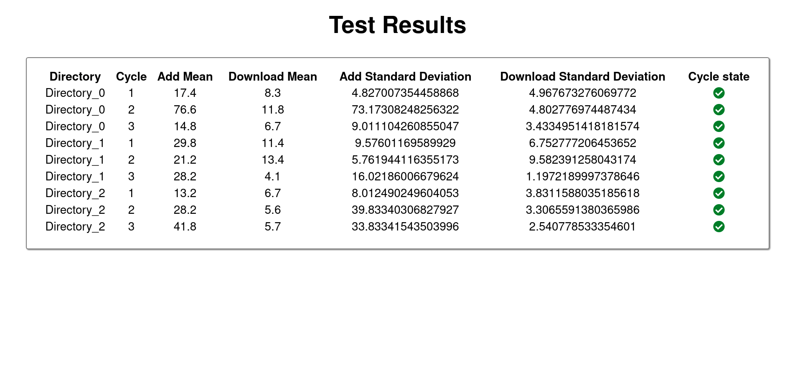
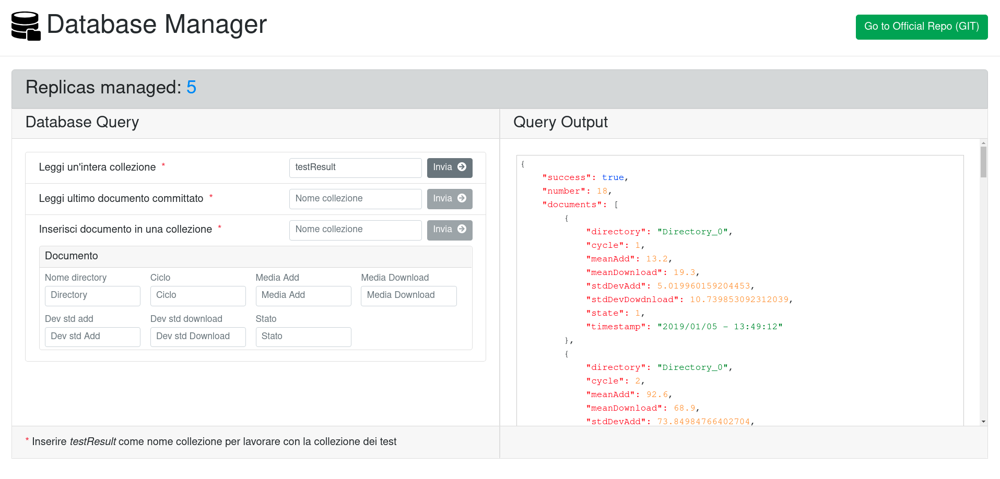

# FileSystemService
A web service for remote filesystem management.

## Table of Contents

- [References](#references)
- [Screenshots](#screenshots)
- [Requirements](#requirements)
- [Dependencies](#dependencies)
- [Testing](#running-for-test)
- [Running](#running-for-production)


## References

Javadoc is available at:

- Docs/apidoc-EJB (**EJB** documentation)

- Docs/apidoc-WEB  (**REST service** and **web application** documentation)

- Docs/apidoc-DBanager  (**DB Writer/Reader** documentation)

- Docs/apidoc-ReplicaManager  (**Replica Manager** documentation)


## Screenshots






## Requirements

- Java8EE
- maven-compiler-plugin 3.1
- MongoDB
- rabbitMQ-server


## Dependencies

- `jackson-annotations 2.6.0`
- `jackson-databind 2.6.7.1`
- `javaee-api 7.0`
- `javaee-web-api 7.0`
- `jersey-container-servlet-core 2.12`
- `jersey-media-multipart 2.13`
- `rabbitMQ amqp-client 5.5.1`
- `mongo-java-driver 3.4.1`


## Running for Test (without **docker**)
You can clone this project and simply run it without starting any docker container, so you can work on it and test it easily and quickly.
#### 1 - Clone the project from develop branch
```bash
git clone --branch develop https://github.com/orazioscavo13/FileSystemService.git
```

#### 2 - Run the RabbitMQ Server
- on Windows:
Run **RabbitMQ Service - start** from start menu

- on Linux:
 ```bash
sudo rabbitmq-server start
```
> NB: you will need to enter your password to run the server


#### 3 - Run the Database
- on Windows:
Go to Mongodb installation folder and run **mongo.exe**

- on Linux:
```bash
sudo systemctl start mongodb.service
```
>NB: The command can change depending on the distribution

#### 4 - Build the project
- Open projects on Netbeans (Homework1, DatabaseManager, ReplicaManager)
- In the **projects** panel, right click and select **Build with Dependencies** on main module (**Homework-1**), on **DatabaseManager** module and in **ReplicaManager** module.


#### 5 - Run the project
In the Netbeans **projects** panel, Right click and select **Run** on **Homework1-ear**, **ReplicaManager**, **Database Manager** (Follow this order to avoid runtime errors!)
>NB: When you run the project for the first time you will need to select a web server. 
The project works on **Glassfish Server 4.1.1** and has been tested on **ArchLinux** and **Windows 10 Home**, it may not work properly on some other platform.

#### 6 - Configure the environment
Depending on the environment you may need to change the port to the REST services in some points of the project (project default is 43636, but often 8080 is the correct port):
- change the value of the attribute 'port' at Homework1-web/RequestSenderService.java (line 28)
- change the value of the port in the 'baseUrl' string at Homework1-web/web-pages/mainController.js (line 10)
- change the value of the port in the 'baseUrl' string at DatabaseManager/web-pages/mainController.js (line 14)
- change the value of the port in the url to the unique replica managed in DatabaseManager/TransactionManager (line 38)

#### 7 - Open the web pages
Now you can navigate to:
- http://localhost:43636/Homework1-web/ (**FileSystemService** frontend)
- http://localhost:43636/DatabaseManager/ (**DatabaseManager** frontend)
- http://localhost:43636/ReplicaManager/ (**ReplicaManager** frontend)

>NB: The port can be different, look at point 6


## Running for Production (with **docker**)

>NB: Before you follow this guide you need to have a working installation of docker on your host!

#### 1 - Clone the project from master branch
```bash
git clone https://github.com/orazioscavo13/FileSystemService.git
```
#### 2 - Build the project
- Open projects on Netbeans (Homework1, DatabaseManager, ReplicaManager)
- In the **projects** panel, right click and select **Build with Dependencies** on main module (**Homework-1**), on **DatabaseManager** module and in **ReplicaManager** module.

#### 3 - Run the project
```bash
cd FileSystemService
sudo docker-compose up
```
>NB: The image building process requires to download heavy docker images, and can take several minutes

#### 4 - Open the web pages
Now you can navigate to:
- http://localhost:8080/Homework1-web/ (**FileSystemService** frontend)
- http://localhost:43637/DatabaseManager-1.0-SNAPSHOT/ (**DatabaseManager** frontend)
- http://localhost:43638/ReplicaManager-1.0-SNAPSHOT/ (**ReplicaManager** frontend)
